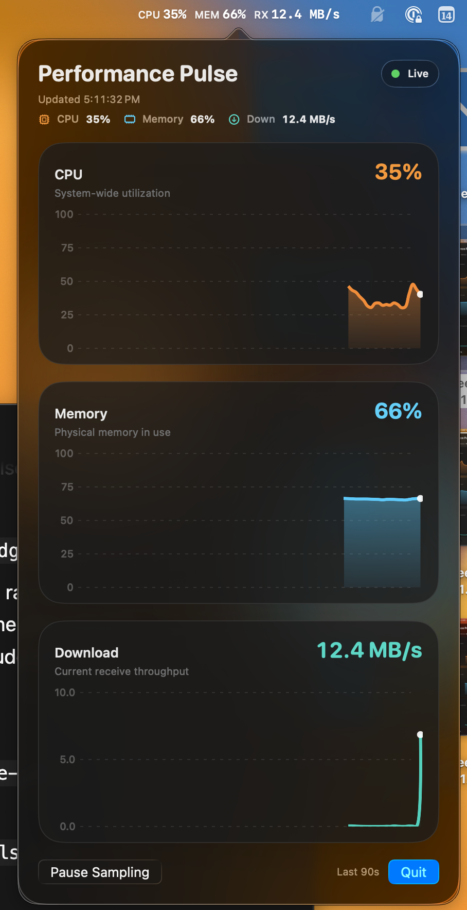

# Performance Pulse

macOS menu bar monitor for CPU usage, memory usage, and receive speed.

<p align="center">
  
</p>

## Features

- CPU, memory, and receive-speed sampling once per second
- Live history charts for all three metrics
- Menu bar readout for CPU, memory, and receive speed
- Pause/resume controls and Reduce Transparency fallback

## Requirements

- macOS 26+
- Swift 6

## Run

```bash
swift run
```

You can also open the package in Xcode and run the `PerformancePulse` executable target.

## Install

```bash
./scripts/install_app.sh
```

## Test

```bash
swift test
```
